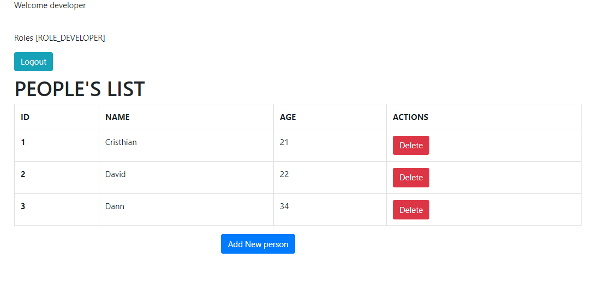
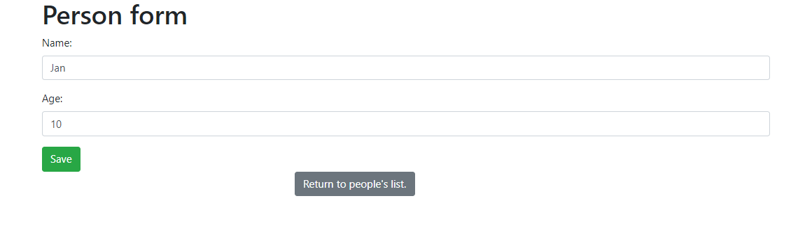
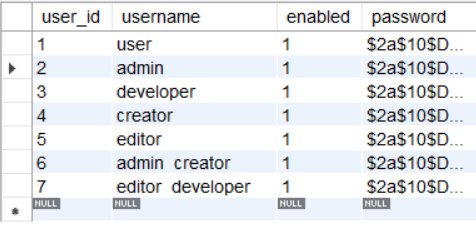
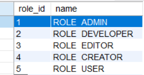
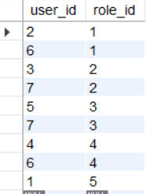

# SPRING BOOT APPLICATION

Web service monoltyh application made using SpringBoot. 
Connection with database locally (JDBC), functionalities implementation to list, add, delete people from a table's database. Including roles to support security provided by Spring Security, authorization, authentication, roles.

Usage of thymeleaf as template engine to show table information and provide its modification.

Including concepts and proper spring methodologies developing approach,
- Spring MVC 

- Spring Security architecture
  - Authentication Manager
  - Authentication Provider
  - Authentication Filters
  - UserDetailsService
  - PasswordEncoder

 

- Security with users in database JDBC
    - Authentication via form
    - Authorization
    - Roles

---
## Site

### Login

### User role dashboard.

### Administrator role dashboard.

### Developer role dashboard.

### Adding people form.

---
## Database

### Users entity.

### Role entity.

### user_roles entity.

---
## Built with
- [Spring](https://spring.io/) - Frameworks for fast, secure and responsive web applications connected to any data storage.
- [Thymeleaf](https://www.thymeleaf.org/) - modern server-side Java template engine for both web and standalone environments.
- [Bootstrap](http://getbootstrap.com/) - Extensive list of components and  Bundled Javascript plugins.
- [Spring security](https://spring.io/projects/spring-security)- Authorization and control-access framework.
